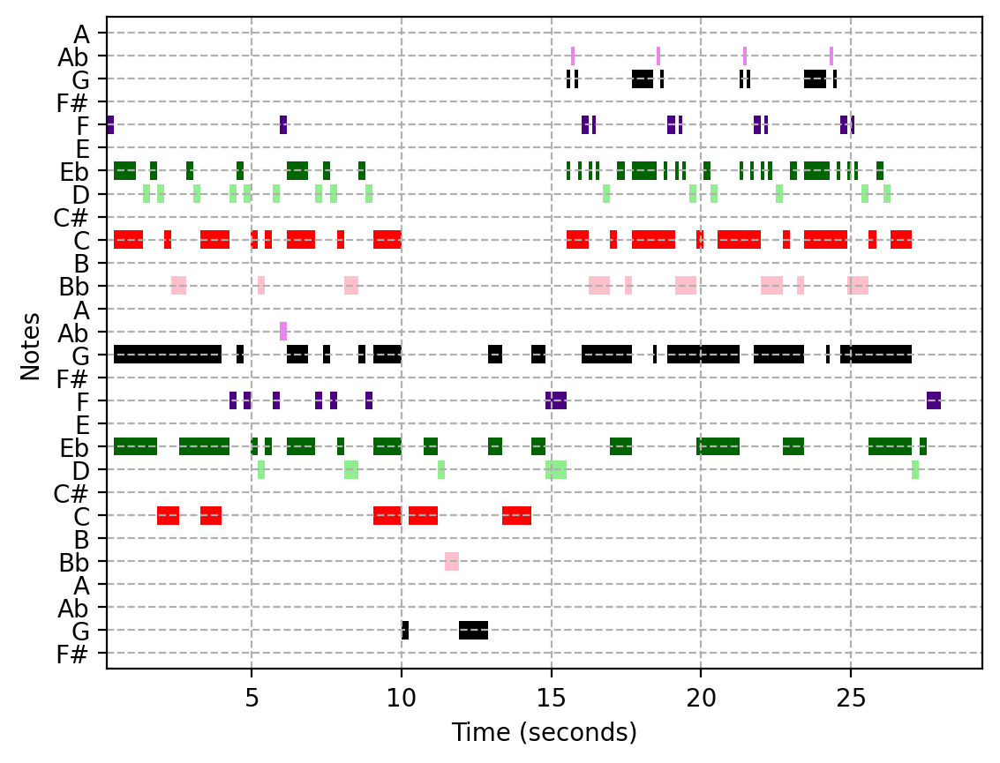
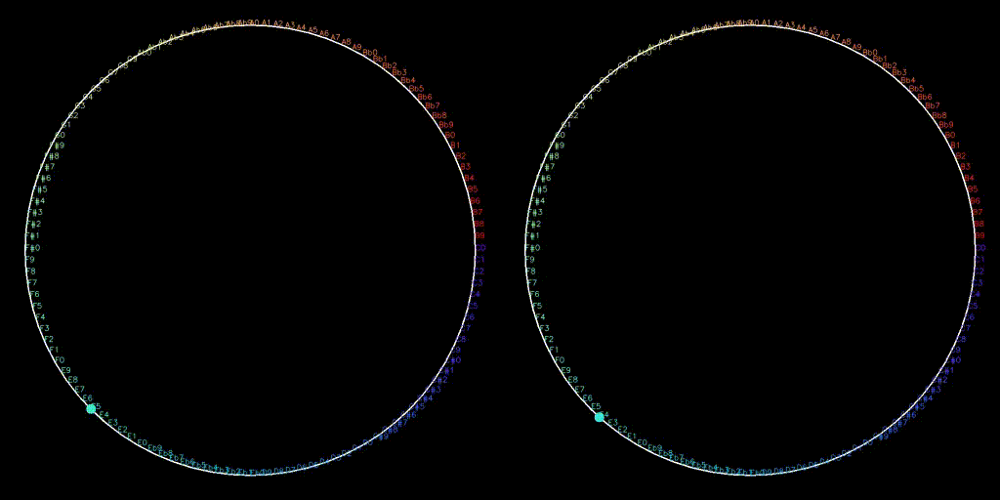

# MusicVis
 Visualiser for music and audio using python

# GUI

- GUI built using streamlit
- To use app locally,
    - Clone the repo and run [StartUI.sh](StartUI.sh) to view the app on your browser!
- App is hosted at [Streamlit](https://kausikn-musicvis.streamlit.app/)
- App can also be run on my [Common Host App](https://kausikn-commonhostapp.streamlit.app/),
    - Choose settings from the left tab dropdown and select "Add New Repo" under Select Setting dropdown
    - Type the repo name and click on "Add Repo"
    - Goto Choose Project from the left tab dropdown, choose the project and click load and deploy.
    - Then go ahead and use the app! 😃
    - If you want to change to another app, simply click on View Other Projects in top left and choose any other project and load and deploy.

# Piano Sequencer
- Load MIDI Files
- Edit piano notes as JSON or using Simple Note Code (described in the app)
- Generate audio from the piano notes
- Visualise MIDI plot of the notes and other visualisations

# Piano Music Generator
- Generate randomised and parameterised piano tracks using basic notes, chords and other tracks
- Generate audio from the generated piano notes
- Visualise MIDI plot of the notes and other visualisations

# Visualisations
## MIDI Plot
- Piano notes visualised as a horizontal bar chart
    - X axis is time
    - Y axis contains the unique notes

## Circle Bouncer
- In a circle where the notes are dispersed uniformly on its perimeter, note sequence is visualised as a video
    - Moving from one note to another triggers a change in the internal part of the circle
    - For "line_sequence" mode, a single line is drawn from the previous note to the current note and the drawn lines persist
    
    ***(Oppenheimer : Can you hear the music?)***
    - For "converge_sequence" mode, a line is drawn from all previous notes to the current note and the drawn lines are cleared at each iteration